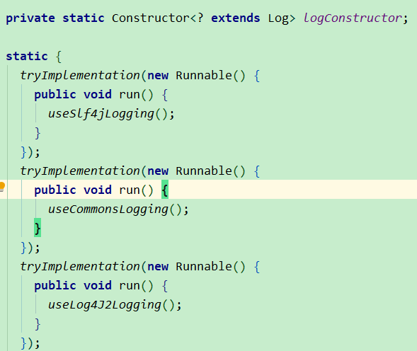
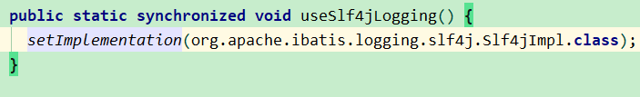
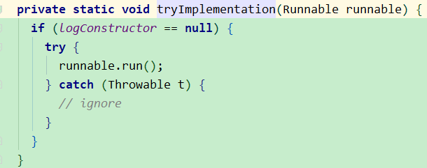
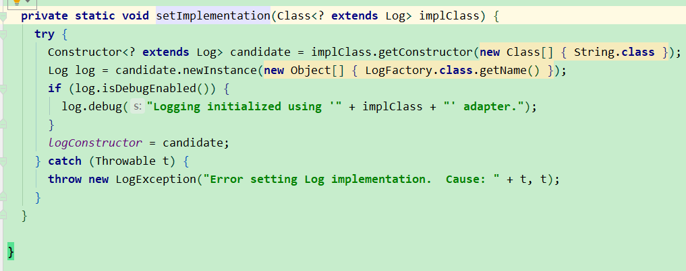
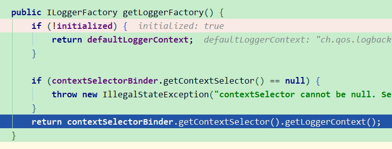

## sql见
work-project-study

## mybatis一级缓存（LocalCache）和二级缓存
见mybatis-cache-demo和second-level-cache

文章参考：[美团MyBatis缓存](https://tech.meituan.com/2018/01/19/mybatis-cache.html)
### 一级缓存（LocalCache）
MyBatis一级缓存（MyBaits 称其为 Local Cache）最大的共享范围就是一个SqlSession内部，无法关闭，但是有两种级别可选：
- session 默认。在同一个 sqlSession 内，对同样的查询将不再查询数据库，直接从缓存中读取。
    > 假设现在有一个服务集群，有两个节点。两个节点（两个sqlSession）都进行了同样的查询，两个节点都有自己的一级缓存，后续同样的查询，两个节点将不再查询数据库。
    >如果此时节点 1 执行了 update 语句，那么节点 1 的一级缓存会被刷新，而节点 2 的一级缓存不会改变，节点2就读到了之前的旧数据。
- statement 每次查询结束都会清掉一级缓存。设置<setting name="localCacheScope" value="STATEMENT"/>

### 二级缓存
设置: a）`<setting name="cacheEnabled" value="true"/>`   b）mapper.xml文件中`<cache/>`或`<cache-ref namespace="mapper.StudentMapper"/>`   
二级缓存开启后，同一个Mapper下的所有操作语句，都影响着同一个Cache，即二级缓存被多个SqlSession共享。
当一个Mapper中有执行更新insert|update|delete时，会清空缓存。

MyBatis在多表查询时，极大可能会出现脏数据，有设计上的缺陷，安全使用二级缓存的条件比较苛刻  
在分布式环境下，由于默认的MyBatis Cache实现都是基于本地的，分布式环境下必然会出现读取到脏数据，需要使用集中式缓存将MyBatis的Cache接口实现，有一定的开发成本，
直接使用Redis、Memcached等分布式缓存可能成本更低，安全性也更高。

## 问题
### logback在这里好像不起作用，debug级别，但是没有打印mybatis查询sql，logback没被加载？
是因为没有maven引入logback，引入了，会起作用的。还在mybatis的源码中发现了日志相关的单元测试，
可以在单元测试中学习。

org.apache.ibatis.logging.LogFactory源码

可以看到在静态块中先后尝试设置几种日志类，先尝试的是Slf4j，如果没有设置成功`if (logConstructor == null)`，就不在尝试其他的

调试Slf4j的源码可以看到会先检测org/slf4j/impl/StaticLoggerBinder.class是否存在，如果存在会调用StaticLoggerBinder.getSingleton().getLoggerFactory()，而logback实现了org.slf4j.impl.StaticLoggerBinder类，在getLoggerFactory()把logback的日志工厂返回，这样就使用logback，使用哪种日志，关键在于哪个日志包实现了StaticLoggerBinder。把对于的日志库依赖引入即可。

logback实现ch.qos.logback.classic.LoggerContext implements  org.slf4j.ILoggerFactory

ch.qos.logback.classic.logger也实现了org.slf4j.Logger接口

